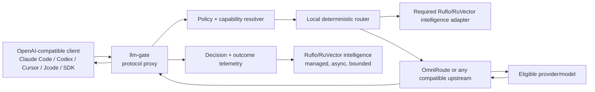

# llm-gate Product Specification
## v0.2 release candidate: intelligent, client-agnostic model-selection proxy

**Status:** Proposed, implementation-blocking specification  
**Owner:** llm-gate maintainers  
**Primary upstream:** OmniRoute-compatible OpenAI API (`LLM_GATE_UPSTREAM_BASE_URL`)  
**Normative language:** MUST, MUST NOT, SHOULD, MAY are requirements levels.

## 1. Product promise

`llm-gate` is a local reverse proxy that accepts standard LLM API traffic, evaluates the request against explicit safety and capability policies, chooses the best currently eligible model, rewrites only the model/provider selection, and forwards the request to a configured upstream router such as OmniRoute.

It is not a Claude Code plugin. It does not require Claude Code, Cursor, Codex, Jcode, Hermes, Cowork, an Agents SDK, or any particular agent framework. A client only needs to speak one supported wire protocol and point its base URL at llm-gate.

The optimization target is **best appropriate model**, not cheapest model:

> Maximize expected task quality subject to hard safety requirements, required capabilities, current availability, latency constraints, privacy constraints, and user policy. Cost is a tie-breaker or an explicit secondary objective, never a reason to violate a quality floor.

## 2. Honest scope

### v0.2 MUST support

- OpenAI-compatible `GET /v1/models`.
- OpenAI-compatible `POST /v1/chat/completions`.
- Request streaming passthrough using Server-Sent Events.
- Tool/function definitions, tool calls, JSON mode, images, system messages, and unknown forward-compatible fields preserved unless a policy explicitly rejects them.
- Configured upstream base URL, including OmniRoute at a user-selected local URL such as `http://127.0.0.1:20132/v1`.
- Dynamic model catalog refresh with local allow/deny filtering.
- Capability-aware selection with deterministic policy and transparent decision metadata.
- Safe retry/fallback for transport failures and rate limits, restricted to idempotent requests and policy-approved alternatives.
- Local health, readiness, configuration validation, and decision observability endpoints.
- Direct SDK/CLI routing API retained for callers that do not need proxying.

### v0.2 MUST provide the intelligence contract

- A mandatory `IntelligenceService` boundary that runs deterministic policy, capability, availability, and explainability logic on every routed request.
- The production profile MUST use the Ruflo/RuVector managed adapter for bounded adaptive routing and outcome learning.
- A deterministic local backend MUST remain present as the safety floor and cold-start path. Adaptive intelligence may rank eligible candidates, but it MUST NOT override hard policy.
- Readiness MUST report the intelligence backend state. Production readiness fails when the required managed backend is unavailable unless an operator explicitly starts a development-only degraded profile.

### v0.2 MAY support behind explicit adapters

- Anthropic Messages protocol (`/v1/messages`) through a tested translation adapter.
- OpenAI Responses API (`/v1/responses`) through a tested translation adapter.
- Provider-specific quota APIs.
- Additional Ruflo guidance gates and model-outcome hooks beyond the required intelligence adapter.
- Additional RuVector SONA trajectory recording and learned-policy suggestions beyond the required intelligence adapter.

### v0.2 MUST NOT claim

- That every model in OmniRoute's `/v1/models` catalog is live, healthy, or quota-available.
- That SONA has autonomous authority to downgrade a hard safety policy.
- That response quality can be inferred from HTTP success alone.
- That Claude Code hooks provide universal interception.
- That the project is 20K-star quality before the release gates in `RELEASE_ACCEPTANCE.md` pass.

## 3. Reference architecture



The proxy MUST always retain a deterministic local safety floor. The production profile MUST have the Ruflo/RuVector intelligence service available and healthy. A standalone deterministic profile MAY exist for development, packaging, and recovery, but it MUST be visibly marked degraded, MUST NOT be presented as production-ready, and MUST require an explicit operator opt-in.

## 4. Request lifecycle

1. **Authenticate local caller.** The proxy MUST support a local bearer token or Unix-socket mode. Anonymous mode MAY be enabled only for loopback in development.
2. **Parse and validate protocol.** Reject malformed requests with protocol-compatible errors. Do not send malformed input upstream.
3. **Redact and fingerprint.** Create a request ID, policy version, prompt fingerprint, message count, estimated input size, and capability requirements. Do not persist raw prompts by default.
4. **Run hard policy gates.** Security, secrets, destructive operations, payment/live-trade execution, production deploys, and user-configured protected domains raise minimum requirements or force an allowlisted frontier route.
5. **Infer capability requirements.** Determine required context size, tool calling, structured output, vision/audio, reasoning, coding, latency, streaming, privacy, and model family constraints.
6. **Refresh and normalize the catalog.** Read the upstream `/v1/models` catalog on a bounded TTL. Apply local allow/deny policy, capability metadata, user overrides, and health/headroom state. A catalog row alone is not proof of availability.
7. **Run mandatory intelligence.** The required IntelligenceService combines deterministic policy with the bounded Ruflo/RuVector adaptive signal. Adaptive output may rank eligible candidates or adjust confidence. It MUST NOT lower a hard minimum, select a denied model, bypass a policy gate, or disable validation.
8. **Select the best eligible model.** Use the scoring contract in `ROUTING_POLICY.md`. Cost is not the primary objective.
9. **Rewrite the request minimally.** Preserve all client fields and set only the selected model plus upstream-specific routing metadata when configured. Never inject hidden instructions into user messages.
10. **Forward and stream.** Preserve status, headers, SSE framing, tool calls, usage, and upstream error semantics as far as the protocol allows.
11. **Fallback only when legal.** Retry only safe/idempotent requests. Never silently downgrade a protected request. For streaming, fallback is permitted only before any response bytes are emitted.
12. **Record an outcome event.** Record transport outcome immediately. Quality feedback is separate and may arrive later through `/v1/outcomes` or the SDK.

## 5. Configuration contract

```yaml
listen:
  host: 127.0.0.1
  port: 8000
  auth_token_env: LLM_GATE_AUTH_TOKEN

upstream:
  base_url: http://127.0.0.1:20132/v1
  api_key_env: OMNIROUTE_API_KEY
  timeout_ms: 30000
  catalog_ttl_seconds: 60
  health_probe: disabled

policy:
  default_task_class: implementation
  protected_classes: [security, auth, payments, live_execution, production_deploy]
  frontier_allowlist: [auto/best-coding, auto/best-reasoning, aug/gpt-5.5-high]
  denied_models: []
  unknown_availability: eligible_only_if_no_known_candidate: false
  minimum_quality_confidence: 0.70
  learned_policy_max_adjustment: 0.10
  allow_client_model_override: false

intelligence:
  required: true
  backend: ruflo_ruvector
  degraded_mode: false
  deterministic_safety_floor: true
  ruflo_hooks: required
  ruvector_sona: required
  max_async_latency_ms: 25
  raw_prompt_logging: false
```

The default upstream MUST be explicit in production. A convenience detector MAY suggest the active local OmniRoute endpoint, but it MUST display the selected URL and require confirmation before changing configuration.

## 6. Public surface

- `GET /health`: process health only.
- `GET /ready`: readiness including upstream connectivity and catalog freshness.
- `GET /v1/models`: filtered, normalized catalog. Include a clear `llm_gate` metadata extension showing `eligible`, `availability_state`, and `capability_profile` where supported.
- `POST /v1/chat/completions`: transparent proxy.
- `POST /v1/route`: explain-only routing decision without dispatch.
- `POST /v1/outcomes`: delayed quality/outcome feedback.
- `GET /metrics`: opt-in Prometheus metrics with no raw prompt content.
- `GET /debug/decision/{request_id}`: local-only, redacted decision explanation.

The explain endpoint MUST show policy version, hard gates, required capabilities, rejected candidates and reasons, selected model, fallback plan, intelligence backend status, and whether adaptive learning influenced ranking.

## 7. Compatibility rules

- Unknown request fields MUST round-trip.
- Request bodies MUST be bounded by configurable size limits.
- Streaming MUST be tested with chunk boundaries split at arbitrary positions.
- Tool calls MUST be tested with multiple calls, partial deltas, and malformed upstream chunks.
- A model rewrite MUST NOT change temperature, top-p, tools, response format, seed, or user metadata.
- Adapters MUST be isolated from the core protocol and have contract tests.

## 8. Release definition

This specification is not complete until the implementation satisfies every gate in `RELEASE_ACCEPTANCE.md`, including live smoke tests against a mock upstream and a configured OmniRoute endpoint, security checks, package validation, and a compatibility matrix covering at least one OpenAI-compatible client library and one raw HTTP client.
